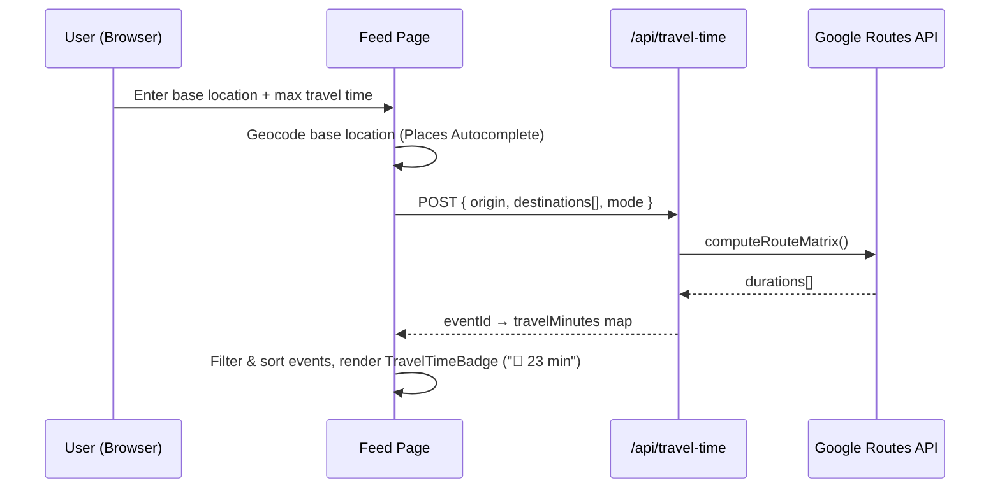

# Wayv MVP — Implementation Plan

A Progressive Web App travel social network connecting young, exploratory travelers with authentic local businesses.

---

## 1. Tech Stack Summary

| Layer | Technology | Version / Notes |
|---|---|---|
| **Framework** | Next.js (App Router) | 15.x, `output: 'standalone'` |
| **UI Library** | React | 19.x (bundled with Next.js 15) |
| **Styling** | Tailwind CSS | **v4** — CSS-first config, `@import "tailwindcss"` |
| **Auth** | Firebase Authentication | Email/Password + Google OAuth |
| **Database** | Cloud Firestore | NoSQL document model |
| **File Storage** | Firebase Storage | Profile pics, event photos |
| **Maps / Geo** | Google Maps JavaScript API, Routes API (Compute Route Matrix), Places API, Geocoding API | Travel-time filtering |
| **PWA** | `@serwist/next` | Service worker + manifest |
| **Containerization** | Docker | Multi-stage build → `node:20-alpine` |
| **Hosting** | Google Cloud Run | Port 3000, `HOSTNAME=0.0.0.0` |

---

## 2. Visual Identity

```
Primary (Mustard/Gold):  #e2b05d
Secondary (Deep Blue):   #033189
Background Dark:         #0a0f1e
Background Light:        #f8f7f4
Surface Dark:            #111827
Surface Light:           #ffffff
Text Primary:            #f1f1f1 (dark mode) / #1a1a2e (light mode)
Text Muted:              #9ca3af
Success:                 #22c55e
Danger:                  #ef4444
```

| Element | Value |
|---|---|
| **Font Family** | `Montserrat` (Google Fonts — weights 400, 500, 600, 700) |
| **Logo File** | `public/Logo_Wayv.svg` (already exists in workspace) |
| **Border Radius** | `0.75rem` (cards), `9999px` (pills/avatars) |
| **Shadows** | Soft `0 4px 24px rgba(0,0,0,.12)` for elevated cards |

### Tailwind v4 Theme (CSS-first in `globals.css`)

```css
@import "tailwindcss";

@theme {
  --color-gold: #e2b05d;
  --color-gold-light: #f0d48a;
  --color-gold-dark: #c49a3a;
  --color-navy: #033189;
  --color-navy-light: #1a4db3;
  --color-navy-dark: #021f5c;
  --color-bg-dark: #0a0f1e;
  --color-bg-light: #f8f7f4;
  --color-surface-dark: #111827;
  --color-surface-light: #ffffff;
  --font-display: "Montserrat", sans-serif;
}
```

---

## 3. Folder Structure

```
wayv/
├── public/
│   ├── Logo_Wayv.svg          # Copied from workspace images/
│   ├── Logo_Wayv.png
│   ├── icons/                 # PWA icons (192, 512)
│   └── sw.js                  # Generated by Serwist
│
├── src/
│   ├── app/
│   │   ├── layout.tsx                 # Root layout (font, metadata, providers)
│   │   ├── manifest.ts                # PWA manifest
│   │   ├── globals.css                # Tailwind v4 + theme tokens
│   │   ├── page.tsx                   # Home → redirects to /feed
│   │   │
│   │   ├── (auth)/                    # Auth route group (no Navbar)
│   │   │   ├── login/page.tsx
│   │   │   └── register/page.tsx
│   │   │
│   │   ├── (main)/                    # Main app route group (with Navbar)
│   │   │   ├── layout.tsx             # Wraps children with Navbar
│   │   │   ├── feed/page.tsx          # Public home feed + filters
│   │   │   ├── event/
│   │   │   │   ├── [id]/page.tsx      # Event detail (public read)
│   │   │   │   └── create/page.tsx    # Create event (auth-gated)
│   │   │   ├── profile/
│   │   │   │   ├── [uid]/page.tsx     # View user / business profile
│   │   │   │   └── edit/page.tsx      # Edit own profile (auth-gated)
│   │   │   └── saved/page.tsx         # Saved events (auth-gated)
│   │   │
│   │   ├── admin/                     # Admin-only route group
│   │   │   ├── layout.tsx             # Admin guard + sidebar
│   │   │   ├── page.tsx               # Dashboard overview (metrics)
│   │   │   ├── users/page.tsx         # User management
│   │   │   └── moderation/page.tsx    # Comments / reviews moderation
│   │   │
│   │   └── api/
│   │       ├── travel-time/route.ts   # Proxy → Google Routes API
│   │       └── admin/
│   │           ├── metrics/route.ts   # Aggregated site metrics
│   │           └── delete/route.ts    # Admin deletion endpoint
│   │
│   ├── components/
│   │   ├── ui/                        # Atomic design components
│   │   │   ├── Button.tsx
│   │   │   ├── Input.tsx
│   │   │   ├── Avatar.tsx
│   │   │   ├── Badge.tsx
│   │   │   ├── Card.tsx
│   │   │   ├── Modal.tsx
│   │   │   ├── Spinner.tsx
│   │   │   └── StarRating.tsx
│   │   │
│   │   ├── layout/
│   │   │   ├── Navbar.tsx
│   │   │   ├── MobileNav.tsx
│   │   │   └── Footer.tsx
│   │   │
│   │   ├── auth/
│   │   │   ├── LoginForm.tsx
│   │   │   ├── RegisterForm.tsx
│   │   │   └── AuthGuard.tsx
│   │   │
│   │   ├── feed/
│   │   │   ├── EventCard.tsx
│   │   │   ├── FilterBar.tsx
│   │   │   ├── LocationInput.tsx
│   │   │   └── TravelTimeBadge.tsx
│   │   │
│   │   ├── event/
│   │   │   ├── EventDetail.tsx
│   │   │   ├── EventForm.tsx
│   │   │   ├── CommentSection.tsx
│   │   │   ├── LikeButton.tsx
│   │   │   ├── SaveButton.tsx
│   │   │   └── ReviewSection.tsx
│   │   │
│   │   ├── profile/
│   │   │   ├── TravelerProfile.tsx
│   │   │   ├── BusinessProfile.tsx
│   │   │   └── ProfileForm.tsx
│   │   │
│   │   └── admin/
│   │       ├── AdminSidebar.tsx
│   │       ├── MetricsCards.tsx
│   │       └── DataTable.tsx
│   │
│   ├── lib/
│   │   ├── firebase/
│   │   │   ├── config.ts              # Client SDK init
│   │   │   ├── admin.ts               # firebase-admin init (server only)
│   │   │   ├── auth.ts                # signIn, signUp, signOut helpers
│   │   │   ├── firestore.ts           # CRUD helpers (events, users, etc.)
│   │   │   └── storage.ts            # Upload / get URL helpers
│   │   │
│   │   ├── maps/
│   │   │   ├── geocode.ts             # Address → lat/lng
│   │   │   ├── travelTime.ts          # Routes API matrix helper
│   │   │   └── placesAutocomplete.ts  # Places Autocomplete wrapper
│   │   │
│   │   ├── hooks/
│   │   │   ├── useAuth.ts             # Auth context consumer
│   │   │   ├── useEvents.ts           # Feed data fetching / filtering
│   │   │   └── useUser.ts             # Current user profile
│   │   │
│   │   ├── context/
│   │   │   └── AuthContext.tsx         # React context + provider
│   │   │
│   │   ├── utils/
│   │   │   ├── cn.ts                  # className merger (clsx)
│   │   │   ├── formatDate.ts
│   │   │   └── validators.ts
│   │   │
│   │   └── types/
│   │       ├── user.ts
│   │       ├── event.ts
│   │       └── interaction.ts
│   │
│   └── middleware.ts                  # Edge middleware for admin route protection
│
├── firestore.rules                    # Firestore security rules
├── storage.rules                      # Storage security rules
├── firebase.json                      # Firebase project config
├── .firebaserc
│
├── Dockerfile
├── .dockerignore
├── docker-compose.yml                 # Local dev with emulators (optional)
│
├── next.config.ts
├── postcss.config.mjs
├── tsconfig.json
├── package.json
└── .env.local.example                 # Template for env variables
```

---

## 4. Firestore Database Schema

### 4.1 `users` Collection

```
users/{uid}
├── role: "Traveler" | "Business" | "Admin"
├── email: string
├── displayName: string
├── profilePicture: string (Storage URL)
├── bio: string (max 280 chars)
├── createdAt: Timestamp
├── updatedAt: Timestamp
│
├── # Business-only fields (role === "Business"):
├── establishmentName: string
├── illustrativePhoto: string (Storage URL)
│
└── # Computed / denormalized:
    └── eventCount: number (increment on event create/delete)
```

### 4.2 `events` Collection

```
events/{eventId}
├── authorId: string (uid ref)
├── authorName: string (denormalized)
├── authorRole: "Traveler" | "Business"
├── title: string
├── description: string
├── photos: string[] (Storage URLs, max 5)
├── location: {
│     address: string,
│     lat: number,
│     lng: number,
│     placeId: string (optional)
│   }
├── startDateTime: Timestamp
├── endDateTime: Timestamp | null
├── isPerennial: boolean (auto-computed: true if endDateTime is null)
├── operatingHours: string (e.g. "Mon-Fri 9am-6pm")
├── unavailableDays: string[] (e.g. ["2026-12-25", "2026-01-01"])
├── category: string (e.g. "Food", "Adventure", "Culture", "Nightlife")
├── createdAt: Timestamp
├── updatedAt: Timestamp
│
└── # Denormalized counters:
    ├── likeCount: number
    ├── commentCount: number
    ├── saveCount: number
    └── avgRating: number
```

### 4.3 `interactions` Sub-collections & Top-level Collections

```
# --- Likes (sub-collection on event for easy query) ---
events/{eventId}/likes/{uid}
├── userId: string
├── createdAt: Timestamp

# --- Comments ---
events/{eventId}/comments/{commentId}
├── userId: string
├── userName: string (denormalized)
├── userAvatar: string (denormalized)
├── text: string
├── createdAt: Timestamp

# --- Reviews / Ratings ---
events/{eventId}/reviews/{reviewId}
├── userId: string
├── userName: string
├── rating: number (1-5)
├── text: string
├── createdAt: Timestamp

# --- Saved Events (per-user, top-level for fast reads) ---
users/{uid}/savedEvents/{eventId}
├── eventId: string
├── savedAt: Timestamp
```

### 4.4 `siteMetrics` Collection (Admin)

```
siteMetrics/daily/{YYYY-MM-DD}
├── pageViews: number
├── uniqueVisitors: number
├── newSignups: number
├── eventsCreated: number
├── date: Timestamp
```

> [!NOTE]
> Firestore does not natively track page views. We'll increment a counter via a lightweight API Route (`/api/admin/metrics`) called from a `useEffect` in the root layout, or alternatively use Firebase Analytics and surface it in the admin dashboard.

---

## 5. Docker Strategy

### 5.1 Dockerfile (Multi-stage)

```dockerfile
# syntax=docker.io/docker/dockerfile:1

# ── Stage 1: Install dependencies ──
FROM node:20-alpine AS deps
RUN apk add --no-cache libc6-compat
WORKDIR /app
COPY package.json package-lock.json* ./
RUN npm ci --omit=dev

# ── Stage 2: Build ──
FROM node:20-alpine AS builder
WORKDIR /app
COPY --from=deps /app/node_modules ./node_modules
COPY . .
ENV NODE_ENV=production
# Build-time env vars injected via Cloud Build / --build-arg
ARG NEXT_PUBLIC_FIREBASE_API_KEY
ARG NEXT_PUBLIC_FIREBASE_AUTH_DOMAIN
ARG NEXT_PUBLIC_FIREBASE_PROJECT_ID
ARG NEXT_PUBLIC_FIREBASE_STORAGE_BUCKET
ARG NEXT_PUBLIC_FIREBASE_MESSAGING_SENDER_ID
ARG NEXT_PUBLIC_FIREBASE_APP_ID
ARG NEXT_PUBLIC_GOOGLE_MAPS_API_KEY
RUN npm run build

# ── Stage 3: Production runner ──
FROM node:20-alpine AS runner
WORKDIR /app
ENV NODE_ENV=production

RUN addgroup --system --gid 1001 nodejs && \
    adduser --system --uid 1001 nextjs

COPY --from=builder /app/public ./public
COPY --from=builder --chown=nextjs:nodejs /app/.next/standalone ./
COPY --from=builder --chown=nextjs:nodejs /app/.next/static ./.next/static

USER nextjs
EXPOSE 3000
ENV PORT=3000
ENV HOSTNAME="0.0.0.0"

CMD ["node", "server.js"]
```

### 5.2 `.dockerignore`

```
node_modules
.next
.git
.env*.local
*.md
.DS_Store
```

---

## 6. Firebase Security Rules (Firestore)

```javascript
rules_version = '2';
service cloud.firestore {
  match /databases/{database}/documents {

    // Helper functions
    function isSignedIn() { return request.auth != null; }
    function isOwner(uid) { return isSignedIn() && request.auth.uid == uid; }
    function isAdmin() {
      return isSignedIn() &&
        get(/databases/$(database)/documents/users/$(request.auth.uid)).data.role == 'Admin';
    }

    // Users
    match /users/{uid} {
      allow read: if true;  // Public profiles
      allow create: if isOwner(uid);
      allow update: if isOwner(uid);
      allow delete: if isAdmin();

      match /savedEvents/{eventId} {
        allow read, write: if isOwner(uid);
      }
    }

    // Events
    match /events/{eventId} {
      allow read: if true;  // Public feed
      allow create: if isSignedIn();
      allow update: if isSignedIn() &&
        resource.data.authorId == request.auth.uid;
      allow delete: if isSignedIn() &&
        (resource.data.authorId == request.auth.uid || isAdmin());

      // Likes
      match /likes/{likeId} {
        allow read: if true;
        allow create, delete: if isSignedIn() && likeId == request.auth.uid;
      }
      // Comments
      match /comments/{commentId} {
        allow read: if true;
        allow create: if isSignedIn();
        allow delete: if isSignedIn() &&
          (resource.data.userId == request.auth.uid || isAdmin());
      }
      // Reviews
      match /reviews/{reviewId} {
        allow read: if true;
        allow create: if isSignedIn();
        allow update: if isSignedIn() && resource.data.userId == request.auth.uid;
        allow delete: if isSignedIn() &&
          (resource.data.userId == request.auth.uid || isAdmin());
      }
    }

    // Admin metrics
    match /siteMetrics/{doc=**} {
      allow read: if isAdmin();
      allow write: if false;  // Server-only writes via firebase-admin
    }
  }
}
```

---

## 7. Access Control Matrix

| Action | Public (no auth) | Traveler | Business | Admin |
|---|:---:|:---:|:---:|:---:|
| Browse feed & view events | ✅ | ✅ | ✅ | ✅ |
| Search / filter by travel time | ✅ | ✅ | ✅ | ✅ |
| Register / Login | ✅ | — | — | — |
| Create event/post | ❌ | ✅ | ✅ | ✅ |
| Like / Comment / Rate | ❌ | ✅ | ✅ | ✅ |
| Save events | ❌ | ✅ | ✅ | ✅ |
| Edit own profile | ❌ | ✅ | ✅ | ✅ |
| Edit own event | ❌ | ✅ | ✅ | ✅ |
| View admin dashboard | ❌ | ❌ | ❌ | ✅ |
| Delete any user/comment/review | ❌ | ❌ | ❌ | ✅ |

---

## 8. Core MVP Feature: Travel-Time Filter

### Architecture



### Key Decisions

1. **Server-side proxy** (`/api/travel-time`): API key never exposed to the client. Rate-limited.
2. **Pre-filter by bounding box**: Before calling Routes API, filter Firestore events within a generous lat/lng bounding box (e.g., ±0.5°) to reduce API calls and cost.
3. **Caching**: Cache route matrix results in a simple in-memory Map with TTL (5 min) keyed by `origin + destination + mode`. For MVP this is sufficient; can upgrade to Redis later.
4. **Travel modes**: Default `DRIVE`. Future: `WALK`, `BICYCLE`, `TRANSIT`.

---

## 9. Environment Variables

```bash
# .env.local.example

# Firebase Client SDK (public)
NEXT_PUBLIC_FIREBASE_API_KEY=
NEXT_PUBLIC_FIREBASE_AUTH_DOMAIN=
NEXT_PUBLIC_FIREBASE_PROJECT_ID=
NEXT_PUBLIC_FIREBASE_STORAGE_BUCKET=
NEXT_PUBLIC_FIREBASE_MESSAGING_SENDER_ID=
NEXT_PUBLIC_FIREBASE_APP_ID=

# Firebase Admin SDK (server only — NEVER prefix with NEXT_PUBLIC_)
FIREBASE_ADMIN_PROJECT_ID=
FIREBASE_ADMIN_CLIENT_EMAIL=
FIREBASE_ADMIN_PRIVATE_KEY=

# Google Maps (server proxy)
GOOGLE_MAPS_API_KEY=

# Google Maps (client — for Places Autocomplete & Map renders)
NEXT_PUBLIC_GOOGLE_MAPS_API_KEY=
```

---

## 10. Build Phases

### Phase 0 — Bootstrap & Configuration
- Initialize Next.js 15 project with TypeScript
- Install & configure Tailwind CSS v4 (CSS-first)
- Install Firebase SDK (`firebase`, `firebase-admin`)
- Install `@serwist/next` for PWA
- Set up `postcss.config.mjs`, `next.config.ts` (standalone output + Serwist)
- Create `globals.css` with theme tokens
- Set up folder structure (`src/app`, `src/components`, `src/lib`)
- Copy `Logo_Wayv.svg` and `Logo_Wayv.png` into `public/`
- Create `app/manifest.ts`
- Create `Dockerfile`, `.dockerignore`
- Create `.env.local.example`

### Phase 1 — Design System & Layout Shell
- Build atomic UI components (`Button`, `Input`, `Card`, `Avatar`, `Badge`, `Modal`, `Spinner`, `StarRating`)
- Build `Navbar` (responsive, logo, nav links, auth-aware)
- Build `MobileNav` (bottom tab bar for mobile)
- Build `Footer`
- Wire up `(main)/layout.tsx` with Navbar + Footer
- Wire up `(auth)/layout.tsx` (centered, no nav)

### Phase 2 — Authentication
- Initialize Firebase client config (`lib/firebase/config.ts`)
- Initialize Firebase Admin (`lib/firebase/admin.ts`)
- Build `AuthContext` provider (wraps app, provides `user`, `loading`, `signIn`, `signUp`, `signOut`)
- Build `LoginForm` + `RegisterForm` (role selection: Traveler / Business)
- Build `AuthGuard` component (redirects unauthenticated users)
- Wire `/login` and `/register` pages
- Build `middleware.ts` for admin route protection

### Phase 3 — Profiles
- Build `ProfileForm` (edit name, bio, profile pic upload)
- Build `TravelerProfile` view component
- Build `BusinessProfile` view component (with event grid)
- Wire `/profile/[uid]` and `/profile/edit` pages
- Implement Firebase Storage upload helpers

### Phase 4 — Events / Posts
- Build `EventForm` (create/edit with photo upload, location picker, date/time pickers, operating hours, unavailable days)
- Build `EventCard` (feed card with photo, title, location, travel-time badge)
- Build `EventDetail` (full page with map, description, interactions)
- Auto-compute `isPerennial` on create/update when `endDateTime` is null
- Wire `/event/create` and `/event/[id]` pages
- Build Firestore CRUD helpers for events

### Phase 5 — Interactions
- Build `LikeButton` (toggle, updates `likeCount` via transaction)
- Build `CommentSection` (real-time listener, create/delete)
- Build `ReviewSection` (star rating + text, updates `avgRating` via transaction)
- Build `SaveButton` (toggle, writes to `users/{uid}/savedEvents`)
- Wire `/saved` page

### Phase 6 — Feed & Travel-Time Filters
- Build `FilterBar` (location input, max travel time slider, category filter, travel mode)
- Build `LocationInput` (Google Places Autocomplete)
- Build `TravelTimeBadge` ("🚗 23 min")
- Build `/api/travel-time` Route Handler (proxy to Routes API, bounding-box pre-filter, caching)
- Wire feed page with Firestore query + client-side travel-time enrichment
- Implement pagination (cursor-based, "Load More")

### Phase 7 — Admin Dashboard
- Build `AdminSidebar` navigation
- Build `MetricsCards` (total users, events, daily signups chart)
- Build `DataTable` (reusable, sortable, with delete action)
- Build `/api/admin/metrics` (aggregates from `siteMetrics` collection)
- Build `/api/admin/delete` (delete user, comment, or review — admin-only, uses `firebase-admin`)
- Wire `/admin`, `/admin/users`, `/admin/moderation` pages
- Track simple page-view metrics

### Phase 8 — PWA & Docker
- Generate PWA icons (192×192, 512×512) from logo
- Configure Serwist service worker (cache-first for static, network-first for API)
- Verify manifest + installability via Lighthouse
- Test Dockerfile build locally
- Create `docker-compose.yml` for local dev (optional Firebase emulators)

---

## User Review Required

> [!IMPORTANT]
> **Tailwind CSS v4 confirmed.** The project will use CSS-first configuration via `@theme` blocks in `globals.css` instead of `tailwind.config.js`.

> [!IMPORTANT]
> **Google Maps API billing.** The Routes API (Compute Route Matrix) charges per element (origin × destination). The MVP strategy pre-filters events by geographic bounding box before calling the API to minimize cost. You will need a Google Cloud project with Maps Platform billing enabled and the Routes API, Places API, Geocoding API, and Maps JavaScript API activated.

> [!WARNING]
> **Firebase project required.** Before Phase 0 execution you will need:
> 1. A Firebase project with Authentication (Email/Password + Google sign-in enabled), Firestore, and Storage provisioned.
> 2. A service account JSON key for `firebase-admin` (server-side).
> 3. The Firebase client config values for `.env.local`.

> [!WARNING]
> **Admin user seeding.** There is no self-serve admin registration flow. The first Admin user will need to be created manually by setting `role: "Admin"` on a user document in Firestore (or via a one-time seed script). This is intentional for security.

## Open Questions

> [!IMPORTANT]
> 1. **Auth providers:** The plan includes Email/Password + Google OAuth. Do you also want Facebook, Apple, or other providers in the MVP?

> [!IMPORTANT]
> 2. **Event categories:** The schema includes a `category` field (e.g., "Food", "Adventure", "Culture", "Nightlife"). Do you have a fixed list of categories in mind, or should this be free-text for the MVP?

> [!IMPORTANT]
> 3. **Image handling:** For MVP, the plan stores full-resolution uploads in Firebase Storage. Would you like automatic image compression/resizing (via a Cloud Function or client-side before upload)?

> [!IMPORTANT]
> 4. **Real-time updates:** Should the feed update in real-time (Firestore `onSnapshot` listeners) or is a pull-to-refresh / manual reload approach acceptable for MVP?

---

## Verification Plan

### Automated Tests
```bash
# Type checking
npx tsc --noEmit

# Lint
npm run lint

# Docker build verification
docker build -t wayv-mvp .
docker run -p 3000:3000 wayv-mvp
```

### Manual Verification
- **Auth flow**: Register as Traveler → login → logout → register as Business → login
- **Event CRUD**: Create event with photos → view in feed → edit → delete
- **Interactions**: Like, comment, rate, save an event → verify counters update
- **Travel-time filter**: Set base location → verify badges show correct travel times → filter by max time
- **Admin dashboard**: Log in as Admin → view metrics → delete a comment → delete a user
- **PWA**: Open in Chrome → verify "Install App" prompt → test offline shell
- **Responsive**: Test on 320px, 768px, 1024px, 1440px viewports
- **Docker**: Build image → run container → verify app loads on `localhost:3000`
